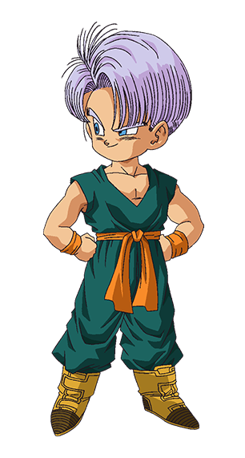

> Super Saiyan components, son of awesome [Bulma]



## API

### `classnames`

This package provides a utility for conditionally joining CSS classes together.

```js
import { classnames } from "trunx"

classnames("foo", "bar") // 'foo bar'
classnames < string > ("foo", ["bar"]) // 'foo bar'
classnames < string > ({ foo: true }, { bar: false }) // 'foo'
```

It accepts a generic "class names" type.

```ts
type T = "foo" | "bar" // my CSS classes
classnames<T>("foo", "quz") // ERROR: not assignable to type ClassnamesArg<T>[]
```

## Motivation

I really like [Bulma] CSS framework and I am also a [Dragon Ball](https://en.wikipedia.org/wiki/Dragon_Ball) fan.
That is why I am creating this component library. I hope you enjoy it!

> Trunks (Japanese: トランクス Hepburn: Torankusu) is a fictional character in the Dragon Ball manga series created by Akira Toriyama.

I remember when I was reading the comics and Trunks arrived from the future. He was really powerful and could defeat Frieza in few seconds. One of the best twists of the entire series, in my opinion.

## License

[MIT](https://fibo.github.io/mit-license)

[bulma]: https://bulma.io "Bulma CSS framework"
