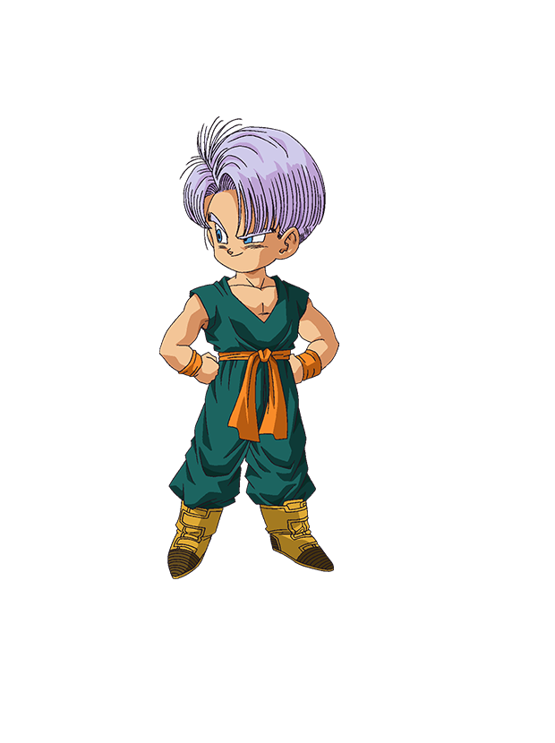

# Trunx

> Super Saiyan React components, son of awesome [Bulma], implemented in TypeScript



## Status

Almost all Bulma features are available and documented, few helpers and custom components are already implemented.

I am using **Trunx** component library in production for my [GoSeven](https://go7.li) website.
It is an open source project, if you want to see code snippets you can check out the repo on GitHub: [github.com/go-seven/go-seven.com](https://github.com/go-seven/go-seven.com).

## Documentation

Please see *components storybook*: [click here](http://g14n.info/trunx).

## Motivation

I really like [Bulma] CSS framework, I love [React] and I am also a [Dragon Ball](https://en.wikipedia.org/wiki/Dragon_Ball) fan.
So, summing all, I am creating this component library. I hope you enjoy it!

> Trunks (Japanese: トランクス Hepburn: Torankusu) is a fictional character in the Dragon Ball manga series created by Akira Toriyama.

I remember when I was reading the comics and Trunks arrived from the future. He was really powerful and could defeat Frieza in few seconds. One of the best twists of the entire series, in my opinion.

## Development

Start *storybook*

```bash
npm run storybook
```

Build

```bash
npm run build
```

Release new version

```bash
npm version [patch|minor|major]
```

Publish storybook

```bash
npm run deploy-storybook
```

## License

[MIT](http://g14n.info/mit-license)

## Credits

Tons of kudos to [Bulma] author!

Trunks png comes from [kisspng](https://www.kisspng.com/png-trunks-gohan-goku-goten-bulma-1996965/).

[Bulma]: https://bulma.io "Bulma CSS framework"
[React]: https://facebook.github.io/react/ "React"
