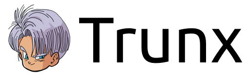
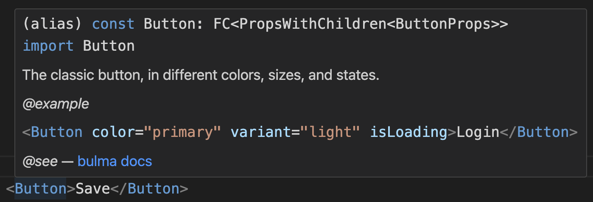

> Super Saiyan components, son of awesome [Bulma]

## Installation

With [npm](https://www.npmjs.com/) do

```sh
npm install trunx
```

Notice that you should also have React installed, minimum version supported is 17 (the transpiled code uses `react/jsx-runtime`). However it is not listed as a peer dependency, you may also use _trunx_ without _React_.

## API

### React components

Components are documented inline with TSDocs. You can configure your editor to display documentation and examples.



Almost all `trunx` components have a `bulma` prop that accepts:

- a string
- an array of bulma classes
- an object which keys are bulma classes
- an array of any of the previous

You know, `trunx` is a Super Sayan because it is written in TypeScript. The `bulma` prop can be autocompleted and typos can be avoided thanks to type checking.

Almost all `trunx` components support a `className` prop, in case you need to append you custom CSS classes.


Some `trunx` components render their homomnym HTML tag.

```tsx
import { Div, Span } from "trunx"
import { FC } from "react"

export const MyComponent: FC<{ isSuccess: boolean }> = ({ isSuccess }) => (
  <Div bulma="block">
    <Span
      bulma={["has-text-weight-semibold", { "has-text-primary": isSuccess }]}
    >
      Lorem ipsum...
    </Span>
  </Div>
)
```

There are also `trunx` React components that implement a Bulma element or a Bulma Component. This means that they usually add a related Bulma class. For example `Button` components renders a button tag with the Bulma `button` class. They may have props related to some Bulma class (.e.g. `color`, `size`). Most of the Bulma related props start with `is`, `has` and the prop name is just the camel-case version of its related Bulma class. For example `isRounded` prop corresponds to `is-rounded` Bulma class.

```tsx
<Button color="primary" size="large" isRounded>
  Download
</Button>
```

You can use the `bulma` prop in case you need to add more Bulma classes that has not a related prop.

```tsx
<Columns isGapless>
  <Column bulma="is-half"></Column>
</Columns>
```

#### Components list

- HTML tags related: `A`, `Article`, `Div`, `Heading`, `P`, `Span`.
- Bulma related:
  - `Breadcrumb`
  - `Button`
  - `Buttons`
  - `ButtonDelete`
  - `Card`
    - `CardContent`
    - `CardFooter`
    - `CardHeader`
    - `CardHeaderIcon`
    - `CardHeaderTitle`
    - `CardImage`
  - `Cell`
  - `Checkbox`
  - `Column`
  - `Columns`
  - `Container`
  - `Content`
  - `Control`
  - `Field`
  - `FieldHorizontal`
    - `FieldBody`
    - `FieldLabel`
  - `FileUpload`
  - `Figure`
  - `FixedGrid`
  - `Footer`
  - `Grid`
  - `Help`
  - `Hero`
    - `HeroBody`
    - `HeroFoot`
    - `HeroHead`
  - `Icon`
    - `IconText`
  - `Input`
  - `Label`
  - `Menu`
    - `MenuLabel`
    - `MenuList`
  - `Message`
  - `Modal`
    - `ModalCard`
    - `ModalClose`
    - `ModalContent`
  - `Navbar`
    - `NavbarBrand`
    - `NavbarBurger`
    - `NavbarDivider`
    - `NavbarDropdown`
    - `NavbarDropdownMenu`
    - `NavbarEnd`
    - `NavbarItem`
    - `NavbarLink`
    - `NavbarMenu`
    - `NavbarStart`
  - `Notification`
  - `Pagination`
    - `PaginationEllipsis`
    - `PaginationLink`
    - `PaginationList`
    - `PaginationNext`
    - `PaginationPrevious`
  - `Progress`
  - `Radio`
  - `Section`
  - `Select`
  - `Table`
  - `Textarea`

### `classnames`

The `trunx` package provides a utility for conditionally joining CSS classes together.

```js
import { classnames } from "trunx"

classnames("foo", "bar") // 'foo bar'
classnames("foo", ["bar"]) // 'foo bar'
classnames({ foo: true }, { bar: false }) // 'foo'
```

It accepts a generic "class names" type.

```ts
type T = "foo" | "bar" // my CSS classes
classnames<T>("foo", "quz") // ERROR: not assignable to type ClassnamesArg<T>[]
```

For example you can use it to compose Bulma classes.

```tsx
import { FC, PropsWithChildren, ButtonHTMLAttributes } from "react"
import { Bulma, classnames } from "trunx"

type MyButtonProps = ButtonHTMLAttributes<HTMLButtonElement> &
  Partial<{ isLoading: boolean }>

export const MyButton: FC<PropsWithChildren<MyButtonProps>> = ({
  isLoading,
  children,
  ...props
}) => (
  <button
    className={classnames<Bulma>("button", { "is-loading": isLoading })}
    {...props}
  >
    {children}
  </button>
)
```

## Motivation

I really like [Bulma] CSS framework and I am also a [Dragon Ball](https://en.wikipedia.org/wiki/Dragon_Ball) fan.
That is why I am creating this component library. I hope you enjoy it!

> Trunks (Japanese: トランクス Hepburn: Torankusu) is a fictional character in the Dragon Ball manga series created by Akira Toriyama.

I remember when I was reading the comics and Trunks arrived from the future. He was really powerful and could defeat Frieza in few seconds. One of the best twists of the entire series, in my opinion.

## License

[MIT](https://fibo.github.io/mit-license)

[bulma]: https://bulma.io "Bulma CSS framework"
